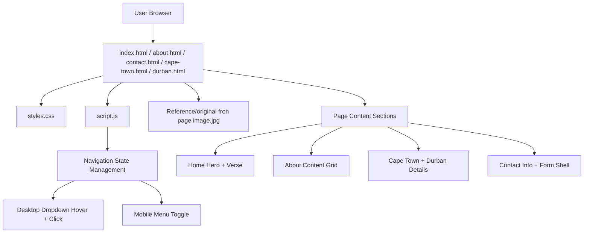
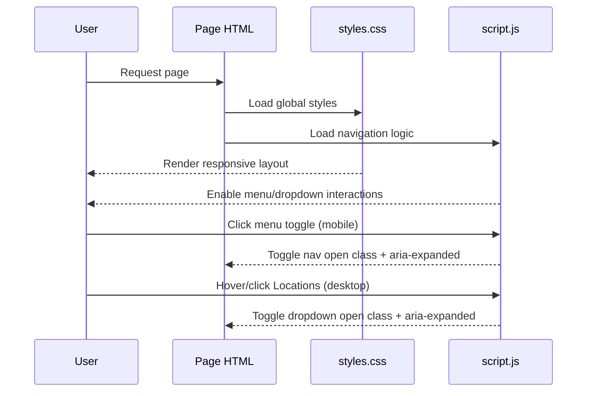

# Rejuvenate Website Architecture

## 1. Website Purpose

Rejuvenate is a static, multi-page ministry/church website.

Its primary goals are:

- Introduce the Rejuvenate movement and its spiritual message.
- Share city-specific gathering details for Cape Town and Durban.
- Explain the ministry background and values.
- Provide a contact path for visitors and prayer/support requests.

The site is content-focused and intentionally lightweight, with no backend dependency.

## 2. High-Level Architecture Layout

## 3. Application Type and Boundaries

- Rendering model: static HTML pages.
- Styling model: single global stylesheet.
- Behavior model: single global JavaScript file for navigation interactions.
- Data model: hardcoded content in HTML.
- Form processing: no backend submission handler is wired yet (`action="#"`).

This means hosting can be done on any static host (GitHub Pages, Netlify, Vercel static, Azure Static Web Apps, etc.).

## 4. File-by-File Architecture Map

### Core Pages

- `index.html`: landing page with hero banner, movement headline, and scripture emphasis.
- `about.html`: ministry context and community explanation.
- `contact.html`: contact details and contact form shell (currently not connected to a server endpoint).
- `cape-town.html`: location-specific details for the Cape Town community.
- `durban.html`: location-specific details for the Durban community.

### Shared Assets

- `styles.css`: global visual system (theme variables, layout, typography, responsiveness, menu/dropdown styles, cards, form styles).
- `script.js`: shared interaction logic (mobile menu toggle, dropdown state, outside-click handling, Escape key handling, desktop hover grace delay).
- `Reference/original fron page image.jpg`: main visual used for hero/page banners.
- `Reference/Rejuvenate.png`: additional brand/image asset available in repository.

## 5. Navigation and Interaction Architecture

### Navigation Structure

Every page uses the same header/nav shell:

- Brand link to Home.
- Main links: Home, About, Locations (dropdown), Contact.
- Responsive menu button for small screens.

### Desktop Dropdown Model

The Locations dropdown supports both hover and click:

- Hover opens the submenu.
- Click toggles persistent open state.
- A small close delay on mouse leave improves click reliability when moving from the trigger to submenu links.

### Mobile Menu Model

At mobile breakpoints:

- Main nav is collapsed by default.
- Menu button toggles nav visibility.
- Locations submenu opens within the stacked mobile nav flow.

### Accessibility Model

- `aria-expanded` is updated for menu and dropdown toggles.
- Escape key closes open nav/dropdowns.
- Outside click closes open menus.
- Focus-visible and keyboard-friendly controls are included via semantic buttons and links.

## 6. Layout and Styling Architecture

### Theme Layer

`styles.css` uses CSS custom properties (`:root`) for:

- background surfaces
- text/muted colors
- accent values
- borders/lines
- shadow depth

This centralizes visual changes and keeps theme updates consistent.

### Component Layer

Reusable patterns include:

- sticky site header
- hero blocks and page-hero variants
- content card grid
- contact form card
- dropdown submenu

### Responsive Layer

Primary breakpoints:

- `max-width: 1080px`: cards shift to 2-column spans.
- `max-width: 820px`: nav becomes collapsible mobile layout; submenu behavior switches to stacked block style.
- `max-width: 520px`: additional typography/spacing adjustments.

## 7. Runtime Behavior Sequence

## 8. What the Website Is For (Business/Ministry View)

This website functions as Rejuvenate's digital front door:

- New visitors discover the ministry and spiritual identity on the Home page.
- Interested users understand mission and community rhythm on the About page.
- People can find local gathering information for Durban and Cape Town.
- Visitors can initiate contact for prayer, questions, and connection.

In short, the site supports awareness, local attendance, and first-contact conversion.

## 9. Current Constraints and Suggested Next Architecture Steps

### Current Constraints

- Contact form has no backend processing.
- Content is duplicated across pages in static markup.
- No analytics or CMS content pipeline.

### Next Steps

1. Wire contact form to a secure backend endpoint or form service.
2. Add server-side or service-based validation for form submissions.
3. Introduce a templating/build step (or framework) to reduce repeated header/footer markup.
4. Add analytics to measure page engagement and location page conversion.
5. Add SEO metadata per page (description, Open Graph, structured data).

## 10. Summary

The application is a static, responsive church/ministry website with shared UI styling and lightweight JavaScript interactions.

Architecture is intentionally simple:

- HTML pages define content and structure.
- one CSS file controls design and responsive behavior.
- one JS file handles all interaction state.

This keeps deployment easy, maintenance straightforward, and future upgrades incremental.
