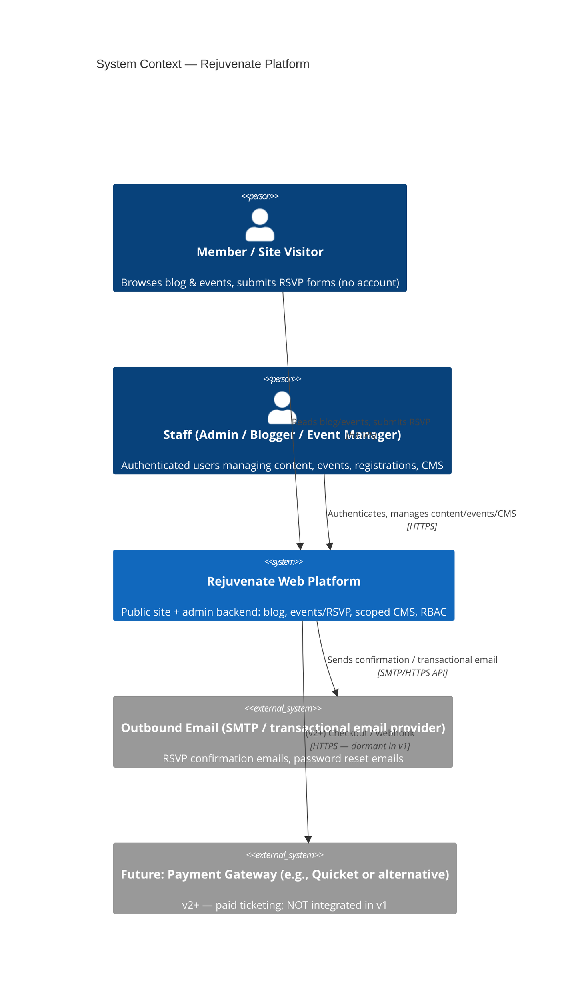
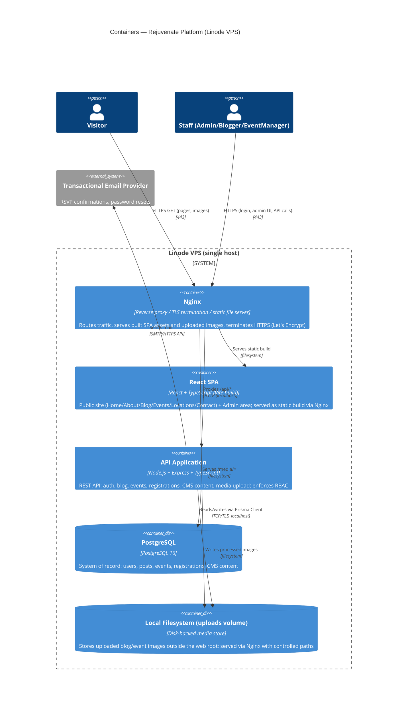
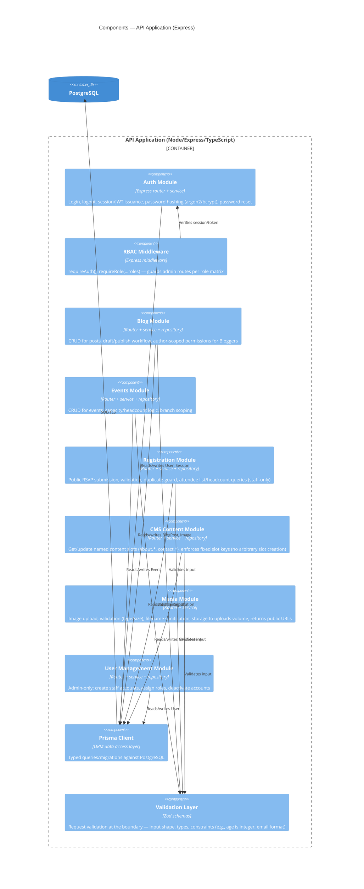
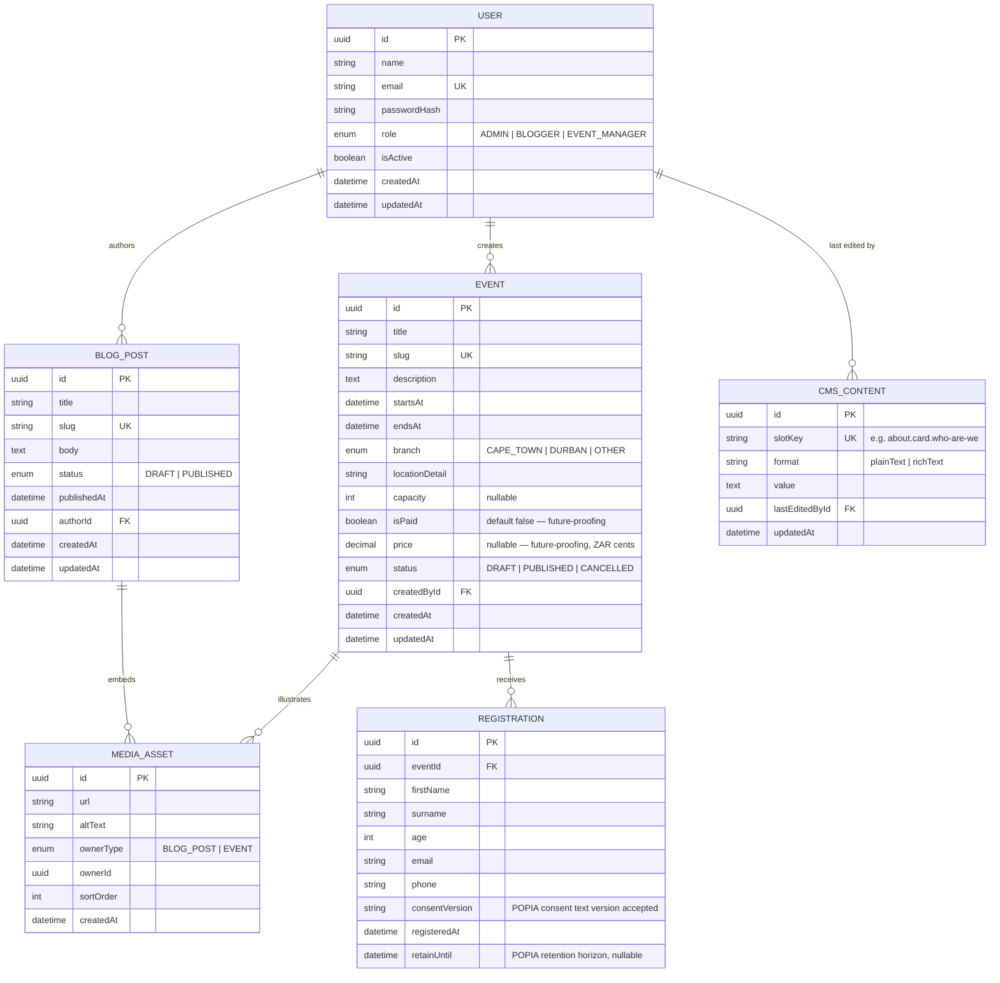
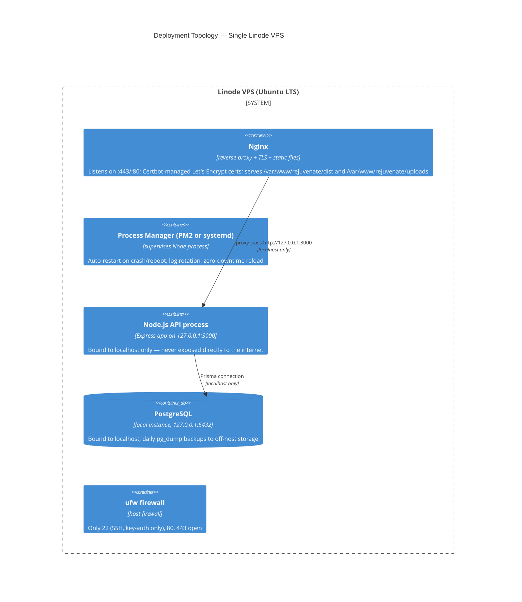

# Rejuvenate — Architecture Document

> Companion to `prd.md` · Status: Proposed · Last updated: 2026-06-07
> Author: Architecture Agent · Audience: implementation team (stack-specialist agent / contracted developer)

---

## 1. Purpose & Scope

This document translates the Rejuvenate PRD into an architecture: how the system is decomposed, how data is modeled, how authentication/authorization works, how the React frontend is organized, how it is deployed on a self-managed Linode VPS, and what security/compliance posture (notably POPIA) the implementation must adopt.

It also records the key architectural decisions as lightweight ADRs, with explicit tradeoffs, so that future maintainers understand *why*, not just *what*.

**Guiding constraint from the PRD:** the existing static site's branding, navigation, layout, and visual identity (logo, color palette, banner images, page structure: Home / About / Cape Town / Durban / Contact) must be preserved. These remain **code-controlled**. Only specific, named content regions become editable via CMS. This is not a redesign — it is the addition of a content/data layer and admin tooling underneath an existing visual identity.

---

## 2. Understanding the Current System (baseline)

Inspection of the existing codebase confirms:

- **Structure**: Five static HTML pages (`index.html`, `about.html`, `cape-town.html`, `durban.html`, `contact.html`) sharing a common header/nav/footer pattern, one global `styles.css`, and one global `script.js` (mobile menu + dropdown behavior).
- **Branding**: Logo (`Reference/rejuvenateLogo.svg`), Google Fonts (Manrope, Space Grotesk), CSS-driven hero banners per page (`.page-hero`, `.page-hero-about`, `.page-hero-cape-town`, `.page-hero-durban`, `.page-hero-contact`), and a recurring `.card` component used for About sections, location/contact cards, and the contact form.
- **Content seams already exist visually**: the About page is composed of `<article class="card">` blocks with `<h2>`/`<p>`; the Contact page has a "Reach Out" card and a contact form card; Cape Town/Durban pages presumably follow the same `.card`/`.location-contact-card` pattern (per the CSS selectors found: `.location-content-grid .event-card`, `.location-contact-card`).
- **No build tooling, no backend, no database** — pure static HTML/CSS/vanilla JS, deployable as flat files.

**Architectural implication**: the `.card` markup blocks that currently hold About/Contact/location text are *exactly* the seams the PRD identifies as CMS-editable (Section 6.5). The new architecture should make these specific DOM regions data-driven (rendered from `CMSContent` records) while leaving the surrounding page chrome (hero, nav, branding, layout grid) as code/components. This is a clean, low-risk seam — it requires no redesign, only "hollowing out" specific text nodes into dynamic content slots.

---

## 3. Quality Attributes (Decision Drivers)

Elicited from the PRD; numeric targets are mostly TBD (flagged), so conservative, low-cost defaults are proposed pending real usage data:

| Attribute | Requirement / Target | Source |
|---|---|---|
| **Operational self-sufficiency** | Admin/Blogger/Event Manager can publish content and manage events/registrations with zero developer involvement — the *defining* success metric | PRD §4 |
| **Scale** | Small-to-mid community org, two branches (Cape Town, Durban). No numeric targets given. Assume low hundreds of concurrent users at peak (event announcements), low thousands of registrations/year. **Revisit after launch with real metrics.** | PRD §3, §13 |
| **Latency** | No SLO given. Target: p95 page load < 2s on typical mobile connections (content-driven site). | PRD §11 |
| **Consistency** | Single-writer, single-region, relational — strong consistency is trivially available and required (no distributed-systems complexity justified) | Inferred |
| **Availability** | No SLA. Self-managed VPS — best-effort, single-instance acceptable for v1; document recovery process | PRD §11, §13 |
| **Evolvability** | Event model must accept paid-ticketing fields later without re-architecture; CMS must map to *named* slots, not generic page-builder | PRD §9, §14 |
| **Security / Privacy** | Hashed credentials; role-gated admin; **POPIA exposure** via RSVP form collecting name, surname, exact age, email, phone from the public | PRD §11, §13 |
| **Accessibility** | No WCAG level specified — bake in baseline practices (semantic HTML, labels, contrast, keyboard nav) given public, community audience | PRD §11 |
| **Team shape** | Presumed solo developer/small contractor team (Conway's Law implication: favor a single deployable monolith the team can operate alone) | PRD §12 |
| **Cost** | Explicit goal: avoid licensing costs; self-managed VPS already chosen | PRD §8, §12 |

**Conway's Law note**: a single (or very small) team building and operating this system is the strongest argument for the "boring," consolidated architecture recommended below — a modular monolith, not microservices.

---

## 4. System Context (C4 — Level 1)



**Key boundary decision**: there is **one system** — a public site and an admin backend served by the same application, differentiated by route and by authentication/authorization, not by separate deployments. This is justified below (ADR-0001).

---

## 5. Container View (C4 — Level 2)



### Container responsibilities

- **Nginx** — single public entry point. Terminates TLS (Let's Encrypt/Certbot), serves the compiled React SPA bundle and uploaded media as static files, reverse-proxies `/api/*` to the Node process, applies basic rate-limiting and security headers, handles gzip/Brotli and cache headers for static assets.
- **React SPA** — one frontend application with two route trees: **public** (no auth) and **admin** (authenticated, role-gated). Built once, deployed as static files — no Node SSR runtime needed (see ADR-0003).
- **API Application** — single Express app exposing a REST API. Organized internally by **bounded sub-domain modules** (auth, blog, events, registrations, cms, media) — a *modular monolith*, not microservices (see ADR-0001). Owns all business rules, RBAC enforcement, validation, and persistence via Prisma.
- **PostgreSQL** — single relational database, single source of truth. Matches the PRD's own rationale (§8): the domain is inherently relational (users → posts, events → registrations, CMS slots → editors).
- **Uploads volume** — local filesystem storage for images (see ADR-0004), outside the SPA's static build directory, served through Nginx with content-type and size constraints.

---

## 6. Component View — API Application (C4 — Level 3, selective)



This follows **Clean Architecture**'s separation of concerns at module level: routers (interface adapters) → services (use cases / application logic) → repositories (Prisma-backed persistence). Domain rules (e.g., "a Blogger may only edit their own posts unless they are an Admin," "a registration cannot exceed event capacity if capacity is set") live in the **service layer**, not in routers or in the database — keeping the Dependency Rule intact (business rules do not depend on Express or Prisma specifics; they depend on small repository interfaces that Prisma implements).

---

## 7. Data Model

### 7.1 Entity-Relationship Overview



### 7.2 Field & Constraint Notes

**User**
- `role` is a single enum (`ADMIN | BLOGGER | EVENT_MANAGER`) — matches PRD §6.4 ("one user has exactly one role"). No many-to-many role table; this is intentionally the *simplest viable* model. If multi-role-per-user ever becomes a real requirement, a join table can be introduced — but YAGNI for now (do not over-build, per CUPID *Predictable*/*Idiomatic*).
- `passwordHash` — argon2id (preferred) or bcrypt; never store plaintext or reversible encryption. `isActive` supports deactivation without destructive deletes (preserves audit trail for authored content).

**BlogPost**
- `status` enum (`DRAFT | PUBLISHED`) plus `publishedAt` timestamp — supports the publish workflow in PRD §6.2.
- `slug` — URL-friendly identifier for SEO-friendly post URLs (`/blog/cape-town-youth-camp-2026`); generated from title, uniqueness enforced at the DB level.
- Author-edit scoping (Bloggers manage own posts only; Admins manage all) is an **application-layer rule** enforced in the service layer — not encoded in the schema. This keeps the schema stable even if the permission policy changes (PRD §13 flags this as TBD/configurable).

**Event**
- `isPaid` (boolean, default `false`) and `price` (nullable decimal, stored as integer cents to avoid floating-point currency bugs) are included **now**, per PRD §9/§14, specifically so v2 paid ticketing does not require a schema migration that touches existing rows. In v1, `isPaid` is always `false` and the public registration flow ignores `price` entirely — **no payment logic is built**. See ADR-0006.
- `branch` enum mirrors the existing site structure (Cape Town / Durban / Other) — generalizable later (PRD §14, "additional branches") by converting to a `Location` reference table; deferred because only two branches exist today (simplest viable model).
- `capacity` nullable — supports the PRD's "optional" capacity field; when set, the Registration service enforces a soft cap (see §7.3 below — waitlisting is explicitly deferred as TBD per PRD §13).

**Registration**
- Deliberately has **no foreign key to User** — registrations are anonymous, one-off submissions (PRD §9, confirmed not to imply a member-account system, PRD §7).
- `age` stored as an exact integer per explicit stakeholder requirement (PRD §6.3) — *not* an age range or birthdate. (Architectural note: storing exact age rather than birthdate is the stakeholder's explicit choice; it is technically a slightly "lossier"/less-precise field over time, but matches the documented requirement exactly — do not silently "improve" this to birthdate without confirming with the stakeholder, since that would change what data is collected and retained.)
- `consentVersion` and `retainUntil` are **POPIA-driven additions** beyond the PRD's literal field list (see §10 Security & Compliance) — they record which version of the consent notice the registrant accepted and establish a basis for a retention policy. These are cheap to add now and expensive to retrofit once the table has rows of un-consented historical data.

**CMSContent**
- Modeled as **named, fixed slots** (`slotKey`), not a generic page-builder/CMS. This directly satisfies PRD §6.5's explicit instruction: "Structure should map cleanly to the specific editable areas... not a generic 'edit anything' system." Slot keys are seeded/migrated by developers (e.g., `about.card.who-are-we`, `about.card.what-we-do`, `about.card.get-involved`, `contact.capeTown.card`, `contact.durban.card`, `contact.page.details`); only their *values* are admin-editable.
- `format` distinguishes `plainText` (renders as-is, escaped) from `richText` (constrained subset — see §9.5 WYSIWYG approach) so the editor and renderer agree on capability per slot, preventing "what you typed isn't what you got" surprises (PRD §6.5's explicit fidelity requirement).

**MediaAsset**
- A single polymorphic-by-convention table (`ownerType` + `ownerId`) covering both blog and event images — avoids two near-identical tables (`BlogImage`, `EventImage`) for what is the same concern (an uploaded, ordered, alt-texted image attached to a content entity). Prisma does not natively support polymorphic relations, so this is implemented as two nullable FKs *or* a discriminated `ownerType`/`ownerId` pair with application-level integrity checks — a deliberate, named tradeoff (see ADR-0005).

### 7.3 Domain Invariants (must always hold)

1. A `User.role` is exactly one of `ADMIN | BLOGGER | EVENT_MANAGER`; role changes are Admin-only operations, audit-logged.
2. A `BlogPost` may be edited/deleted by its author OR by any `ADMIN`; an `EVENT_MANAGER` has zero blog access; a `BLOGGER` has zero event/CMS access (PRD §6.4 access matrix — see §9 RBAC).
3. A `BlogPost` is publicly visible only when `status = PUBLISHED` and `publishedAt <= now()`.
4. An `Event` is publicly visible (and accepts registrations) only when `status = PUBLISHED`.
5. A `Registration` can only be created against a `PUBLISHED` event whose `startsAt` has not passed (no RSVPs to events that already happened, configurable).
6. If `Event.capacity` is set, the count of `Registration` rows for that event must not exceed `capacity` — enforced transactionally at submission time (race-safe via a DB-level check or serializable transaction) to avoid overselling under concurrent submissions. Waitlisting beyond capacity is **out of scope for v1** (PRD §13 — flagged TBD; the simplest viable behavior is to reject/soft-close registration once capacity is reached, with a clear public message).
7. `Registration.age` must be a positive integer within a sane bound (e.g., 0–120) — validated at the API boundary, not just the UI.
8. `CMSContent.slotKey` values are drawn from a fixed, developer-defined set; the API rejects writes to unknown slot keys (prevents the "generic CMS" anti-pattern the PRD explicitly warns against).
9. `Event.isPaid = true` and non-null `price` are *accepted by the schema* but **never produced or acted upon by v1 application logic** — this is a dormant, forward-compatible field, not a feature (PRD §14; ADR-0006).

---

## 8. API Design Approach

**Style**: REST over JSON, versioned from day one at the path level (`/api/v1/...`) — cheap insurance against breaking the SPA when the API evolves (e.g., when paid ticketing introduces new event endpoints in v2).

**Resource-oriented routes** (representative, not exhaustive):

```
Public (no auth):
  GET  /api/v1/blog/posts                  — paginated, published only
  GET  /api/v1/blog/posts/:slug            — single published post + images
  GET  /api/v1/events                      — paginated, published, filterable by branch/upcoming
  GET  /api/v1/events/:slug                — single published event
  POST /api/v1/events/:slug/registrations  — public RSVP submission (rate-limited, validated)
  GET  /api/v1/cms/:slotKey                — resolved CMS slot value (or bundled into page payloads)

Authenticated (role-gated; see RBAC matrix §9):
  POST   /api/v1/auth/login
  POST   /api/v1/auth/logout
  POST   /api/v1/auth/password-reset/*
  GET    /api/v1/me

  GET    /api/v1/admin/blog/posts            (Admin: all; Blogger: own)
  POST   /api/v1/admin/blog/posts
  PATCH  /api/v1/admin/blog/posts/:id
  DELETE /api/v1/admin/blog/posts/:id
  POST   /api/v1/admin/blog/posts/:id/publish | /unpublish

  GET    /api/v1/admin/events
  POST   /api/v1/admin/events
  PATCH  /api/v1/admin/events/:id
  DELETE /api/v1/admin/events/:id
  GET    /api/v1/admin/events/:id/registrations      — attendee list + headcount
  GET    /api/v1/admin/events/:id/registrations.csv  — export for logistics planning

  GET    /api/v1/admin/cms/:slotKey
  PUT    /api/v1/admin/cms/:slotKey

  POST   /api/v1/admin/media                 — image upload (returns URL + id)

  GET    /api/v1/admin/users                 (Admin only)
  POST   /api/v1/admin/users                 (Admin only — create staff account)
  PATCH  /api/v1/admin/users/:id             (Admin only — role/active changes)
```

**Conventions**:
- **Validation at the boundary** using schema-validation (Zod or equivalent) — every mutating endpoint validates shape, types, and constraints (e.g., `age` is an integer 0–120, `email` is a valid address) before it reaches service logic. This is the first POPIA control: garbage personal data is rejected, not stored.
- **Pagination** via cursor or page/limit on all list endpoints from day one — prevents "it was fine until the blog had 400 posts" surprises.
- **Idempotency-conscious mutations**: registration submission checks for an existing `(eventId, email)` pair within a short window to softly guard against accidental double-submits (not a hard uniqueness constraint, since the same person may legitimately register a companion under a different name from the same email).
- **Errors**: a consistent problem-details-style JSON error shape (`{ error: { code, message, fields? } }`) so the SPA can render field-level validation errors generically.
- **CSV export of registrations** is called out explicitly — it operationalizes PRD §6.3's "attendee list for logistics planning" into something Event Managers can hand to caterers/security without screen-scraping an admin table.

---

## 9. Authentication & Authorization (RBAC)

### 9.1 Authentication approach — session-based, server-side, cookie-delivered

**Decision**: cookie-based server-side sessions (e.g., `express-session` backed by a PostgreSQL session store), not JWTs in browser storage.

**Rationale (tradeoff named explicitly)**:
- The admin backend is a small, low-traffic, same-origin application (SPA + API served from one Nginx host). The classic justification for JWTs — stateless horizontal scaling across services/origins — does not apply to a single-VPS modular monolith.
- Server-side sessions can be **revoked instantly** (an Admin deactivating a Blogger's account takes effect immediately) — JWTs in browser storage cannot be revoked before expiry without an additional denylist mechanism, which reintroduces the statefulness JWTs were meant to avoid.
- HttpOnly, Secure, SameSite=Lax cookies remove an entire class of XSS-driven token-theft risk that plagues `localStorage`-stored JWTs.
- ⚠️ Tradeoff given up: JWTs would make a future split into separate API/SPA origins or mobile-app clients marginally simpler. This is explicitly **not** a goal (PRD §7 — no mobile app; PRD confirms single integrated stack). If that changes materially, session auth can be layered with a token-issuing endpoint later without touching the data model.

Passwords are hashed with **argon2id** (preferred over bcrypt for new systems — memory-hard, GPU-resistant) with per-user salts generated by the library; minimum password policy and a rate-limited login endpoint (to blunt credential-stuffing) are required from day one.

### 9.2 Authorization — RBAC matrix

A small, fixed, three-role matrix — no permission-engine, no dynamic policy DSL (CUPID *Predictable*: the simplest model that satisfies the stated requirement).

| Capability | Admin | Blogger | Event Manager |
|---|:---:|:---:|:---:|
| Create/edit/publish own blog posts | ✅ | ✅ | ❌ |
| Edit/unpublish/delete **any** blog post | ✅ | ❌ (own only — PRD §6.2 default assumption, confirm with stakeholder) | ❌ |
| Create/edit/publish events | ✅ | ❌ | ✅ |
| View attendee lists / headcounts / export | ✅ | ❌ | ✅ |
| Edit CMS content (About/Contact/location cards) | ✅ | ❌ | ❌ |
| Create staff accounts / assign roles | ✅ | ❌ | ❌ |
| Upload media (scoped to own content area) | ✅ | ✅ (blog only) | ✅ (events only) |

This matrix is implemented as **two composable Express middlewares** — `requireAuth()` and `requireRole(...roles)` — applied per-route, plus a service-layer ownership check (`post.authorId === currentUser.id || currentUser.role === 'ADMIN'`) for the Blogger-own-posts rule. This keeps authorization **declarative at the route layer** and **rule-based in the service layer**, matching Clean Architecture's guidance that policy belongs in use cases, not frameworks.

⚠️ **Open question carried from PRD §13**: confirm with the stakeholder whether Bloggers may ever edit each other's posts. The architecture defaults to "own posts only," and changing this later is a one-line service-layer change — not a schema or architecture change. Flagging it here so it is decided deliberately, not by accident.

### 9.3 Account provisioning

Per PRD §13 (presumed, to be confirmed): **Admins create staff accounts and assign roles** — there is no public staff self-registration. The `POST /api/v1/admin/users` endpoint is Admin-only and is the sole account-creation path. Password reset uses a time-boxed, single-use token emailed to the account's registered address (requires the transactional email integration named in §5).

### 9.4 Public access

Visitors require no authentication for any read path or for RSVP submission (PRD §6.4 — "public visitors require no login"). RSVP submission endpoints are **unauthenticated but defended**: rate-limited per IP, schema-validated, and equipped with a low-friction bot defense (e.g., a honeypot field or lightweight challenge — full CAPTCHA is likely overkill for this scale and adds friction to a form collecting sensitive personal data; revisit if spam becomes a real problem).

### 9.5 WYSIWYG / "mirrors live rendering" approach for CMS editing

The PRD is explicit (§6.5) that admin text-box editing must produce **no formatting surprises** — what the admin types/sees in the editor must match the live render exactly.

**Recommended approach**: constrain most CMS slots to **plain text with minimal, explicit formatting** (line breaks and paragraph breaks only), rendered through the *same* React components used on the live site, inside the admin preview. Concretely:
- The admin editor is a plain `<textarea>`-style control (or a minimal rich-text editor constrained to a tiny allow-list: bold, italic, line breaks — no headings, tables, embeds, or arbitrary HTML).
- The **exact same React rendering component** that displays a card on the public About/Contact page is reused, live, in the admin editing screen as a "preview pane" rendering the in-progress value — guaranteeing What-You-See-Is-What-You-Get by construction (the renderer is shared, not duplicated).
- Stored `format: plainText` values are escaped on render (XSS defense — see §10); `format: richText` values (if any slot truly needs basic emphasis) are sanitized server-side against a strict allow-list before storage (never trust client-sanitized HTML).

⚠️ **Tradeoff named**: this rules out a full WYSIWYG rich-text experience (embedded images, custom layouts, arbitrary HTML) for CMS slots. That is the *correct* tradeoff here — PRD §6.5 explicitly scopes CMS to small, structured text regions (cards, contact details), and explicitly keeps layout/branding code-controlled. A heavier editor (TipTap, Lexical, etc.) is justified for **blog post bodies** (PRD §6.2 — "rich text/body content and embedded images" is a stated requirement there), but would be over-engineering for a contact card. Different slots, different tools — chosen deliberately, not uniformly.

---

## 10. Frontend Architecture (React SPA)

### 10.1 Structure

A **single React + TypeScript application** (built with Vite), with two route trees sharing a design-system layer:

```
src/
  app/                     — routing, providers, layout shells
  design-system/           — shared primitives ported 1:1 from existing styles.css
                             (Header, Nav, Footer, Card, PageHero, Button — visual identity is code)
  public/                  — public route tree (no auth)
    pages/
      Home/  About/  CapeTown/  Durban/  Contact/
      Blog/  (BlogIndex, BlogPostDetail)
      Events/  (EventsIndex, EventDetail, RsvpForm)
  admin/                   — admin route tree (authenticated, role-gated)
    pages/
      Login/  Dashboard/
      Blog/   (PostList, PostEditor)
      Events/ (EventList, EventEditor, RegistrationsView)
      Cms/    (SlotEditor — reuses public rendering components for live preview)
      Users/  (Admin-only: StaffAccountList, StaffAccountEditor)
    components/
      RoleGuard, RequireAuth
  shared/
    api/                   — typed API client (generated from/aligned to backend Zod schemas)
    hooks/  utils/  types/
```

### 10.2 Routing & access control

- **Public routes** (`/`, `/about`, `/cape-town`, `/durban`, `/contact`, `/blog`, `/blog/:slug`, `/events`, `/events/:slug`) require no authentication and render from public API endpoints; pages are statically structured (existing layout/branding) with dynamic content slotted in (CMS values, blog lists, event lists).
- **Admin routes** (`/admin/*`) are wrapped in a `RequireAuth` guard (redirects to `/admin/login` if no valid session) and a `RoleGuard` (hides/blocks routes and UI affordances the current role cannot use — e.g., an Event Manager never sees a "Blog" nav item). **Server-side authorization is the actual security boundary**; client-side role gating is a UX convenience only — never trust the client to enforce access (defense in depth: the API independently re-checks every request).

### 10.3 Preserving branding & layout (the "code-controlled" boundary)

The existing `styles.css` visual language (color palette, typography — Manrope/Space Grotesk, hero banners, `.card` styling, responsive breakpoints, mobile nav behavior already tuned per the recent "Cape Town mobile banner top gap" fix) is **ported into the design-system layer as React components and CSS**, not rebuilt from scratch. This:
- Honors PRD §12 ("existing branding/look-and-feel/navigation/page structure should be preserved/extended, not replaced")
- Keeps layout, nav, and branding **in code** (PRD §6.5's explicit non-goal for CMS), trivially satisfying "developer/code-controlled" by virtue of being React components compiled into the bundle
- Lets CMS-editable text slot cleanly into the *existing* `.card` markup pattern identified in §2 of this document — minimal structural change, maximal continuity for end users

### 10.4 Data fetching & state

- A thin, typed API client wrapping `fetch`, with React Query (TanStack Query) for server-state caching/invalidation (e.g., re-fetch the blog list after publishing a post). This avoids hand-rolled cache logic and gives the admin UI responsive, optimistic-friendly interactions without a heavyweight global state library — the public site barely needs client state at all (it is fundamentally a content browser).
- Forms (RSVP, blog editor, event editor, CMS slot editor, login) use a schema-driven form library (e.g., React Hook Form + Zod resolvers) so the **same validation schema shapes** can be shared conceptually between client and server, reducing "the API rejected something the form said was fine" mismatches.

---

## 11. Deployment & Hosting Architecture (Linode VPS)

### 11.1 Topology — single host, process-managed, reverse-proxied



### 11.2 Key operational decisions

- **Nginx as the single internet-facing process**: terminates TLS via Let's Encrypt (Certbot auto-renewal cron), serves the React production build and uploaded media directly (fast, no Node overhead for static assets), and reverse-proxies `/api/*` to the Node process bound to `127.0.0.1` only. Postgres likewise binds to localhost only. **The firewall (`ufw`) permits only SSH (key-based, password auth disabled), 80, and 443.** This minimizes the attack surface to exactly what must be public.
- **Process supervision**: PM2 (or a systemd unit) keeps the Node API alive across crashes and VPS reboots, handles log rotation, and supports near-zero-downtime reloads on deploy (`pm2 reload`).
- **Database**: a single PostgreSQL instance on the same host (justified at this scale — avoids the operational cost of a separate DB host for a small-to-mid community org). **Automated daily `pg_dump` backups**, shipped off-host (e.g., to Linode Object Storage or another remote target) — a single-VPS architecture without off-host backups is a single point of total data loss, which is unacceptable given the system now holds personal data (POPIA implications — see §12).
- **Static assets & uploaded images**: stored on local disk in a directory **outside** the SPA's build output (e.g., `/var/www/rejuvenate/uploads`), served by Nginx with a dedicated `location /media/ { ... }` block enforcing content-type allow-lists and disabling script execution in that directory (defense against malicious file uploads being served as executable content). See ADR-0004 for the local-filesystem-vs-object-storage tradeoff.
- **Deploy process**: a simple, scripted pipeline (git pull → `npm ci` → `npm run build` → `prisma migrate deploy` → `pm2 reload`) — deliberately not a heavyweight CI/CD platform at this scale (matches "avoid licensing costs," PRD §8/§12, and the presumed solo/small-team operating model).
- **TLS**: HTTPS is mandatory site-wide (not just `/admin`) — the public RSVP form transmits personal data and must never do so over plaintext HTTP. Certbot auto-renewal verified by a monitoring check (see below).
- **Monitoring/observability** (lightweight, cost-conscious): uptime checks (e.g., a free-tier external uptime monitor hitting `/healthz`), Nginx/PM2 log retention with rotation, and a `/healthz` endpoint on the API that checks DB connectivity — enough to know the system is up and to diagnose outages, without standing up a full observability stack that a solo operator cannot realistically maintain.

### 11.3 Environments

At minimum: **production** + **local development** (Dockerized Postgres for parity is recommended for the dev machine). A staging environment is a "nice to have" but not mandated — given the open-ended timeline and small team (PRD §12), a tested migration process and a reliable rollback (git revert + `prisma migrate resolve` + redeploy) substitute adequately for a full staging tier at this scale. **Revisit if release frequency or team size grows.**

---

## 12. Security & POPIA / Privacy Considerations

This is the PRD's most explicitly flagged risk (§11, §13): the public RSVP form collects **name, surname, exact age, email, and phone number** — all personal information under South Africa's Protection of Personal Information Act (POPIA). The architecture must not treat this as an afterthought.

### 12.1 Concrete controls baked into the design

1. **Data minimization at the schema level**: the `Registration` table stores *only* the fields the PRD names (PRD §6.3) — no IP address, no device fingerprint, no marketing-consent flags beyond what's needed. Resist any temptation to "capture more while we're at it."
2. **Explicit consent capture**: `Registration.consentVersion` records which version of a POPIA-compliant consent/privacy notice the registrant accepted at submission time (PRD §13 flags "whether explicit consent language is needed" — the architecture's answer is: yes, capture it, and version it so notice changes are auditable). The public RSVP form must display this notice (purpose of collection, who can see it — Event Managers/Admins — and retention) before submission.
3. **Retention policy as a first-class field, not an afterthought**: `Registration.retainUntil` gives the system a place to encode "delete or anonymize N months after the event" — satisfying POPIA's data-minimization and storage-limitation principles. **This requires an organizational decision** (how long does Rejuvenate need attendee data after an event?) — flagged as an open question for the stakeholder (carried from PRD §13). Once decided, a scheduled job (cron + script, or a PM2 cron-like task) anonymizes/purges expired registrations automatically — privacy-by-design rather than a manual, forgettable chore.
4. **Encryption in transit**: HTTPS site-wide, including all admin and public form traffic (§11.2).
5. **Encryption at rest** (recommended): enable PostgreSQL data-at-rest encryption or full-disk encryption on the VPS volume — a relatively low-cost control that meaningfully reduces exposure if the physical disk or VPS snapshot is ever compromised.
6. **Access control & audit**: only `ADMIN` and `EVENT_MANAGER` roles can view registration data (RBAC matrix, §9.2); every read of an attendee list is implicitly auditable via the session-based auth model (the acting user is always known server-side). Consider a lightweight audit log table for *exports* of registration data specifically (who downloaded the attendee CSV and when) — this is the most likely vector for personal data to leave the system's control.
7. **Least-exposure defaults**: registration confirmation emails (if implemented — recommended per PRD §5.2 "receives confirmation") should not echo back more personal data than necessary, and should come from a properly configured sending domain (SPF/DKIM) to avoid being flagged as spam or spoofable.
8. **Input validation as a security control, not just a UX nicety**: schema validation (Zod) at the API boundary (§8) prevents malformed/oversized/malicious payloads from ever reaching the database — this is also a basic defense against injection-style attacks (though Prisma's parameterized queries already prevent SQL injection by construction).
9. **XSS defense for user-generated and admin-edited content**: blog post bodies and CMS rich-text values are sanitized server-side against a strict allow-list before storage and/or escaped on render (§9.5) — never rendered as raw `dangerouslySetInnerHTML` from unsanitized input.
10. **Secrets management**: database credentials, session secrets, and email-provider API keys live in environment variables / a `.env` file **outside** version control (confirm `.gitignore` coverage), with restrictive file permissions on the VPS.

### 12.2 Organizational actions required (cannot be solved by architecture alone)

- **Confirm POPIA obligations formally** with the organization (ideally with legal/compliance input) — the architecture provides the *mechanisms* (consent capture, retention fields, access control, encryption) but the **policy values** (retention period, exact consent wording, information-officer designation required under POPIA for certain organizations) are organizational decisions that must be supplied. This is carried forward verbatim from PRD §13 as a **blocking question for go-live**, not a "nice to confirm eventually."
- **Designate an Information Officer** (POPIA requires organizations processing personal information to register one) — outside the system's scope, but the system should provide that officer a way to fulfill data-subject requests (access, correction, deletion) — which the Admin role's user/registration management views should support operationally.

---

## 13. Architecture Decision Records (ADR Summaries)

Full MADR-format records should be written to `docs/architecture/adr/` as the project repo is set up. Summarized here for the implementation brief:

### ADR-0001: Modular Monolith over Microservices
- **Decision**: Build one Express application internally organized into bounded modules (auth, blog, events, registrations, cms, media), backed by one PostgreSQL database — not separate services per domain.
- **Drivers**: small/solo team (Conway's Law), low traffic, no independent-scaling requirement, cost/operability constraints (self-managed VPS).
- **Consequences**: ✅ One deployable unit, one database to back up/secure/operate, trivial transactional consistency across modules (e.g., creating an event and its initial CMS-linked promo text in one transaction). ⚠️ Tradeoff: modules cannot be scaled, deployed, or owned independently — acceptable because no driver demands it. 🔄 If the org grows dramatically (multiple branches each needing localized teams/deployments), bounded-context seams are already drawn at the module level, making a future extraction *possible* without a rewrite.

### ADR-0002: Session-Based Authentication over JWT
- **Decision**: Server-side sessions in HttpOnly cookies, backed by a Postgres session store.
- **Drivers**: instant revocability, single-origin deployment, reduced XSS/token-theft surface, no independent-client requirement.
- **Consequences**: ✅ Simple, secure-by-default, revocation is a DB delete. ⚠️ Tradeoff: marginally more friction if a separate API consumer (e.g., future mobile app) appears — explicitly out of scope (PRD §7). 🔄 Token-based auth can be added as an additional strategy later without schema changes if ever needed.

### ADR-0003: Static-Built React SPA over Server-Side Rendering
- **Decision**: React SPA built to static assets (Vite), served by Nginx — no Node SSR runtime (no Next.js server, no Remix server).
- **Drivers**: the public site is content-driven but not SEO-extreme (a community blog/events site, not a commerce storefront); operational simplicity (one fewer Node runtime to supervise/secure); cost.
- **Consequences**: ✅ Simpler deploy (static files + API), smaller attack surface, cheaper to operate on a single VPS. ⚠️ Tradeoff: weaker out-of-the-box SEO/social-preview metadata for blog posts and events compared to SSR — mitigated with prerendered `<head>` meta tags per route via a lightweight build-time prerender step or static meta injection if SEO becomes a priority. 🔄 Revisit if organic search traffic to blog/event pages becomes a measured priority.

### ADR-0004: Local Filesystem for Image Storage over Object Storage
- **Decision**: Store uploaded images on the VPS's local disk (outside the web/build root), served via a dedicated Nginx location block; not Linode Object Storage or S3-compatible storage.
- **Drivers**: PRD explicitly leaves this TBD (§10, §13); cost (object storage adds a recurring line item); scale (a small-to-mid community org's image volume is unlikely to stress local disk for years).
- **Consequences**: ✅ Zero added cost, zero added integration complexity, fully within the "self-managed, no licensing cost" stack philosophy. ⚠️ Tradeoff: local disk must be backed up alongside the database (already planned, §11.2), and disk space must be monitored as the blog/event library grows; horizontal scaling of the API tier (were it ever needed) would require shared storage. 🔄 If image volume or redundancy needs grow materially, migrating to S3-compatible object storage is a contained change (swap the Media module's storage adapter; URLs remain stable if a CDN/redirect layer is introduced).

### ADR-0005: Polymorphic-by-Convention MediaAsset Table
- **Decision**: One `MediaAsset` table with `ownerType`/`ownerId` discriminator columns, shared by `BlogPost` and `Event`, rather than separate `BlogImage`/`EventImage` tables.
- **Drivers**: avoid duplicating identical concerns (ordered, alt-texted, uploaded images attached to a content entity); DRY at the schema level.
- **Consequences**: ✅ One upload pipeline, one set of validation/storage rules, simpler Media module. ⚠️ Tradeoff: the database cannot enforce referential integrity on the polymorphic relation (no FK constraint across two possible parent tables) — integrity is enforced in the application/service layer instead, and must be tested accordingly (a fitness-function-style integration test asserting orphaned `MediaAsset` rows cannot occur). 🔄 If a third ownerType (e.g., CMS-slot images) emerges, this table absorbs it without a new migration shape.

### ADR-0006: Forward-Compatible (but Dormant) Paid-Ticketing Fields on Event
- **Decision**: Add `isPaid` (boolean, default `false`) and `price` (nullable integer cents) to `Event` now; build **zero** payment logic, checkout flow, or gateway integration in v1.
- **Drivers**: PRD §14 — stakeholder explicitly anticipates paid events; Prisma migrations make adding columns to an existing table with defaults a non-breaking, zero-downtime operation either way — but adding them *now*, before any rows exist, costs nothing and removes a future migration-on-live-data risk entirely.
- **Consequences**: ✅ When paid ticketing is greenlit, the schema requires no destructive change — only new tables (e.g., `Order`, `Payment`) and new service/route modules layered alongside the existing `Event` module (Open/Closed Principle in action at the architecture level). ⚠️ Tradeoff: two inert columns exist in the schema for a feature that may never ship — a small, deliberate, well-understood cost (the alternative — retrofitting later — is strictly worse). 🔄 The actual gateway choice (Quicket reactivation vs. an alternative like Paystack/PayFast, both more POPIA/ZAR-native than international defaults) is explicitly deferred — do not pre-integrate a gateway "just in case."

### ADR-0007: Named-Slot CMS over Generic Page Builder
- **Decision**: `CMSContent` is a fixed, developer-defined set of named slots (`slotKey`), editable only in value — not a generic block/page-builder CMS.
- **Drivers**: PRD §6.5 explicitly mandates this ("not a generic 'edit anything' system"); layout/nav/branding must remain code-controlled (PRD §6.5, §12).
- **Consequences**: ✅ Editors cannot break layout, cannot introduce inconsistent branding, cannot create orphaned/unused content — the WYSIWYG fidelity guarantee (§9.5) is achievable *because* the rendering surface per slot is known and fixed at build time. ⚠️ Tradeoff: adding a new editable region (e.g., a future "Durban service times" card) requires a small developer change (new slot key + migration + render-slot wiring) — this is a **feature, not a bug**: it keeps "what is editable" a deliberate, reviewed decision rather than an emergent, uncontrolled one. 🔄 If Admins find v1 scope limiting (PRD §14 anticipates this), expanding the slot set is cheap and incremental — no architecture change required, just more slots.

---

## 14. Implementation Brief — for stack-specialist agent

### Components to Build
- **Auth module**: session-based login/logout/password-reset, argon2id password hashing, rate-limited login endpoint.
- **RBAC middleware**: `requireAuth()`, `requireRole(...roles)`, plus service-layer ownership checks for Blogger-own-post rules.
- **Blog module**: CRUD + draft/publish workflow + author-scoped permissions; public list/detail endpoints (published-only).
- **Events module**: CRUD + branch scoping + capacity enforcement; public list/detail endpoints (published, upcoming-filterable).
- **Registration module**: public RSVP submission (validated, rate-limited, capacity-checked, consent-captured), staff-only attendee list/headcount/CSV export.
- **CMS module**: fixed-slot get/update, plain-text and constrained-rich-text formats, server-side sanitization.
- **Media module**: image upload (type/size validated, filename-sanitized), local-disk storage outside web root, public URL issuance.
- **User management module**: Admin-only staff account creation, role assignment, deactivation.
- **React SPA**: public route tree (Home/About/branches/Contact/Blog/Events/RSVP) + admin route tree (Dashboard/Blog/Events/Registrations/CMS/Users), with a shared design-system layer ported from the existing `styles.css`/branding.
- **Deployment scripting**: Nginx config (TLS, reverse proxy, static + media serving, security headers), PM2/systemd unit, Postgres setup + automated off-host backups, Certbot auto-renewal, ufw firewall rules.

### Contracts (Interfaces)
- `AuthService.login(email, password) → Session | AuthError`; invariant: failed attempts are rate-limited per IP+email combo.
- `BlogService.createPost(author, input) → BlogPost`; invariant: `status` starts as `DRAFT`; only `Admin`/post-author can transition to `PUBLISHED`.
- `EventService.registerAttendee(eventId, input) → Registration | CapacityExceededError | ValidationError`; invariant: rejected if event not `PUBLISHED`, already started, or at capacity (transactional check).
- `CmsService.updateSlot(slotKey, value, editor) → CMSContent | UnknownSlotError`; invariant: `slotKey` must exist in the developer-defined slot registry; value sanitized per `format`.
- `MediaService.upload(file, ownerType, ownerId) → MediaAsset | ValidationError`; invariant: MIME type and size allow-listed; filenames sanitized/randomized to prevent path traversal and collisions.

### Domain Invariants (recap — see §7.3 for full list)
- One role per user; Registration has no User FK (anonymous); Event capacity enforced transactionally; CMS slot keys are fixed and developer-controlled; `isPaid`/`price` are present but inert in v1.

### Quality Attributes (must satisfy)
- HTTPS site-wide; p95 page load < 2s on typical mobile connections; session revocation is immediate; daily off-host DB+media backups; zero plaintext password storage; all personal-data fields validated server-side regardless of client validation.

### Explicit Non-Goals (v1)
- No payment processing, checkout, or gateway integration (Quicket or otherwise) — schema is ready, logic is not built.
- No member accounts/login/profiles — registrations remain anonymous one-off submissions.
- No generic/arbitrary CMS — only the named slots enumerated in PRD §6.5.
- No waitlisting beyond capacity — capacity-reached registrations are rejected with a clear message (revisit if stakeholder confirms it's needed).
- No microservices, no container orchestration, no managed PaaS — single VPS, modular monolith.
- No heavyweight observability stack — health-check endpoint + external uptime monitor + log rotation only.

### Open Questions for Specialist (carried from PRD §13, require stakeholder confirmation before/at build time)
- Confirm Blogger cross-author edit permissions (own-only assumed/default).
- Confirm Admin-only staff account creation/role assignment (presumed).
- Confirm event capacity/waitlisting behavior (currently: hard-reject at capacity).
- **Confirm POPIA retention period for `Registration` data and required consent-notice wording** — this blocks finalizing the `retainUntil` purge job and the public RSVP form's consent copy; treat as a go-live blocker, not a post-launch nice-to-have.
- Confirm disposition of the dormant Quicket placeholder in the current codebase (remove vs. leave inert) — recommend **removal**, since it is unused, and a future gateway choice is not yet locked to Quicket (ADR-0006 leaves the gateway choice open).
- Confirm transactional email provider (for RSVP confirmations and password resets) — none specified in the PRD; pick one with a South African-friendly sending reputation and POPIA-aware data handling (e.g., regional or self-hosted SMTP relay vs. a US-based SaaS provider — a data-residency consideration worth surfacing to the organization).

---

## 15. Next Steps & Fitness Functions

**Validate before/during build:**
1. Stakeholder sign-off on the **POPIA retention period and consent wording** (blocking — see §12.2, §14).
2. Confirm the Blogger cross-author and event-capacity open questions (§13/§14) — cheap to decide now, costly to discover wrong in production.
3. Walk through the existing `cape-town.html`/`durban.html` markup (not fully inspected here) to confirm the `.location-contact-card` seams map cleanly to the proposed `contact.capeTown.card`/`contact.durban.card` CMS slots — adjust slot keys to match real markup structure before building the editor.

**Defer (explicitly, with rationale already on record):**
- Object storage migration (ADR-0004) — until disk-space or redundancy pressure is real.
- Payment gateway integration (ADR-0006) — until the organization commits to paid events.
- Multi-branch generalization beyond Cape Town/Durban (PRD §14) — until a third branch is real.
- Staging environment — until release cadence or team size grows.

**Fitness functions to add (automated checks that keep the architecture honest over time):**
- Integration test asserting no `MediaAsset` row references a non-existent `BlogPost`/`Event` (guards the polymorphic-relation tradeoff in ADR-0005).
- Test asserting `Registration` count never exceeds `Event.capacity` under concurrent submission (guards invariant §7.3.6).
- Test asserting `CMSContent` writes to unknown `slotKey` values are rejected (guards ADR-0007's "fixed slots" guarantee).
- Scheduled job + test asserting registrations past `retainUntil` are anonymized/purged (guards POPIA retention control, §12.1.3) — **only buildable once the retention period is confirmed** (open question above).
- A simple Lighthouse/axe accessibility check in CI (or a pre-deploy script) against public pages — operationalizes the "baseline accessibility good practice" goal (PRD §11) into something measurable rather than aspirational.
